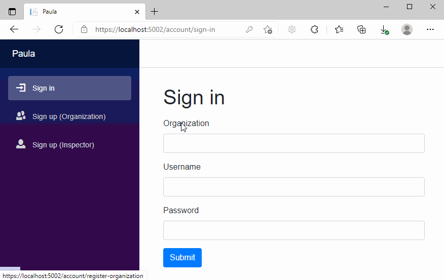
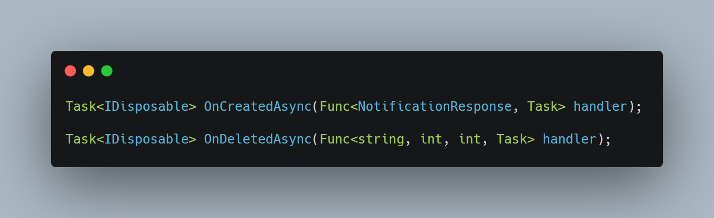
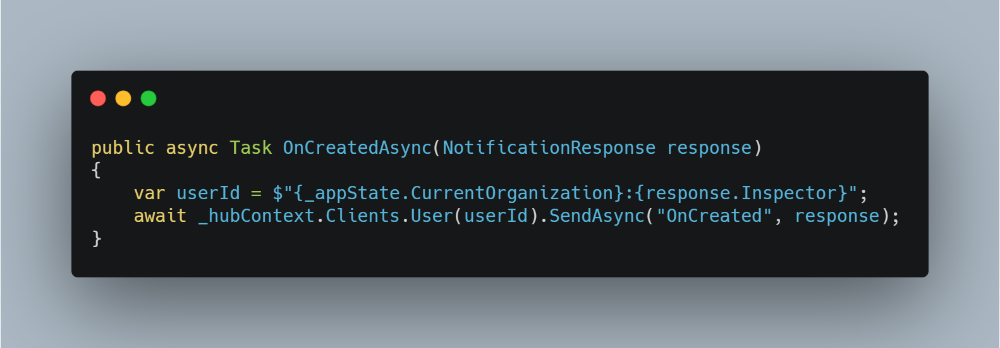
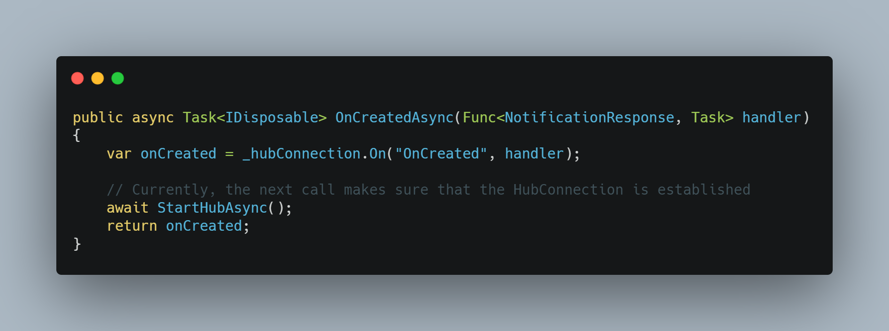
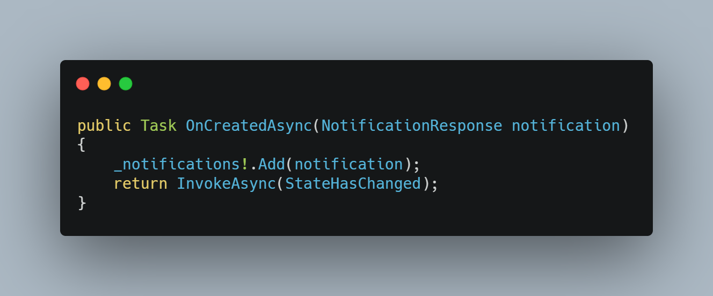

# Building a Business Application, Part 2

A couple of weeks ago my PO asked me if I had any experience with [SignalR](https://dotnet.microsoft.com/apps/aspnet/signalr). I had to disappoint him, as none of my private projects nor any of our company products included real time communication.

Since I’m still experimenting with my experimental business application, I thought this would be a cool learning experience and entry point for a new feature.

The simplest use case I could think of was a notification for an inspector when he is assigned to a business object. The endgame should be extensibility to all kinds of notifications.

I will not go into the specifics on how to [get started with SignalR](https://docs.microsoft.com/de-de/aspnet/core/signalr/introduction?view=aspnetcore-5.0). The only thing that matters right now is that SignalR uses a WebSocket to communicate between the client and the server. The most common introductory example is normally a chat or messaging app. This is far more than what I wanted. For my use case a push from the server to the client is sufficient.

The rest of this article will become very technical. It contains some code snippets, but does also omit a lot, as this is only a learning experience and not a tutorial.

## Into the Code (back end).

After understanding how SignalR works and after the decision how I would integrate it into my back end, the implementation was kind of easy.

I wrote a new notification handler with two delegate registration method. 

* The handler of `OnCreatedAsync` is triggered when a notification is created. 
* The handler of `OnDeletedAsync` is triggered when a notification is deleted.

The registration is setup by a factory which is used by the DI framework during the service creation.

The actions given into `OnCreatedAsync` and `OnDeletedAsync` will just call the SignalR `IHubContext` and send a message to the client that needs to be informed.

The nice thing is that SignalR handles user tracking automatically. You only need to make sure that the `NameIdentifier` `Claim` is set during the authentication. Karma has it that i already did that in my pseudo toke based authentication.

The SignalR `Hub` itself contains nothing as I don't receive messages from the client.

## Into the Code (client side).

The client side uses the same interface for its handler, which means I have `OnCreatedAsync` and `OnDeletedAsync` on the client side as well. This is perfect, as I can uses them to update the GUI. The implementation of `OnCreatedAsync` just registers the action in the SignalR `HubConnection`.

And that’s it. I added some more infrastructure code and did some caching, but that is just noise around the basic implementation.

Once everything was set up and I got my first notification, I thought that the whole thing is to easy. Sure all of this is experimental, but in my opinion I‘m still free of hacks and spaghetti code.

Thanks for reading.

Enjoy. 
