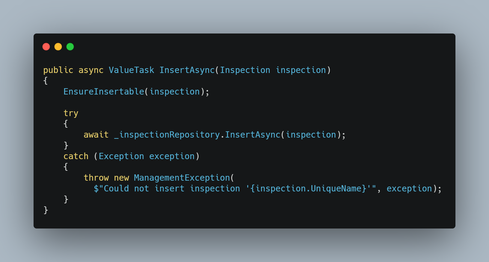

# Building a Business Application, Part 4

Today, I want to talk about validating front end inputs and back end data.

This article will paint a rough picture on the error handling and validation in my experimental prototype. It does not aspire to be perfect nor does it claim to be complete or the best approach. If you can agree with those terms, you may continue.

Until now I did not really mention validation and error handling in detail, as I started with my experimental business application as a prototype without any of that stuff. You could use any format and any data an the values would end up in the database. If data constrain would be violated, an exception would be thrown somewhere in the request processing stack and might even break the Blazor application.

But I had in mind that I would later add validation at multiple stages. This was a little test an my implementation skills. *Am I able to add validation in a subsequent development stage, without much refactoring?*

I like to think of it as a single responsibility principle for myself. A couple of years ago I would respect all eventualities in the first step of my implementation, as I wanted to cover all failure cases from the beginning. This would usually postpone my prototype and would even make my code ugly. Fast and overthinking usually means not good in my case.

If I focus on the essentials, the essentials become better. When the essentials are complete, I start to think about other aspects. Two of these other aspects are validation and error handling.

The following aspects needed to be respected:

* Validate input data on the client side
* Validate input data on the server side
* Handle errors
* Display errors and validation messages

The following implementation can only be seen as its own first prototype of validation. It can still be improved, but that comes with refactoring in the future.

# Clint side validation

Blazor supports data annotations on properties.

If properties of DTOs are annotated with validation attributes and the *DataAnnotationsValidator* is added to the *EditForm*, a simple validation response for the user is quickly set up. This is a client side validation only, as the *DataAnnotationsValidator* will not send any request to the server. 

You can even add your own validation attributes, to force a particular pattern on some properties.

# Endpoint data validation

If you are familiar with ASP.NET MVC, you know that it will support data annotation validation of the incoming model as well.

In ASP.NET MinimalAPI this is not yet the case, but I have feeling that MinimalAPI will evolve in the next versions. 

I'll omit validation of incoming data on the endpoint level for now.

# Business logic validation
 
I always like an additional validation step, which I am in charge of, right before I give the data to the data layer. This is the place where I experimented.

In my professional work environment we have the credo to always develop against an interface and only inject interfaces. Another word for it is dependency inversion. We also do this for validators, as it eliminates hard dependencies and also makes it easy to unit test as we can just mock away the validator. The downside of this approach *can* lead to complex validations that might even execute queries against the database. This will make an application slower and, in case of an application that relies an Azure RU/s, it also becomes more expensive.

That’s why I decided to use a static validation approach. It makes it hard to access dependencies and it keeps the validation fast.

Additionally, any exceptions that might occur while accessing the data layer are caught and rethrown with a prettier error message. 

# Error handling

Exceptions which are triggered, are caught by the ASP.NET Middleware where they are converted into *ProblemDetails*. 

The problem details are send to the client application, where they are received and converted into a client side exception.

The exception is handled with a global *ErrorBoundary*. Which displays the error in a very simple layout.

There is still room for improvement, but that is a story for another day. The most important thing for me is, that the error chain is working.

Bye.
