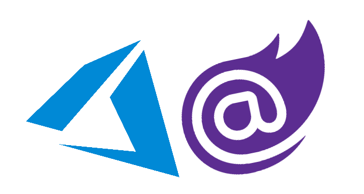
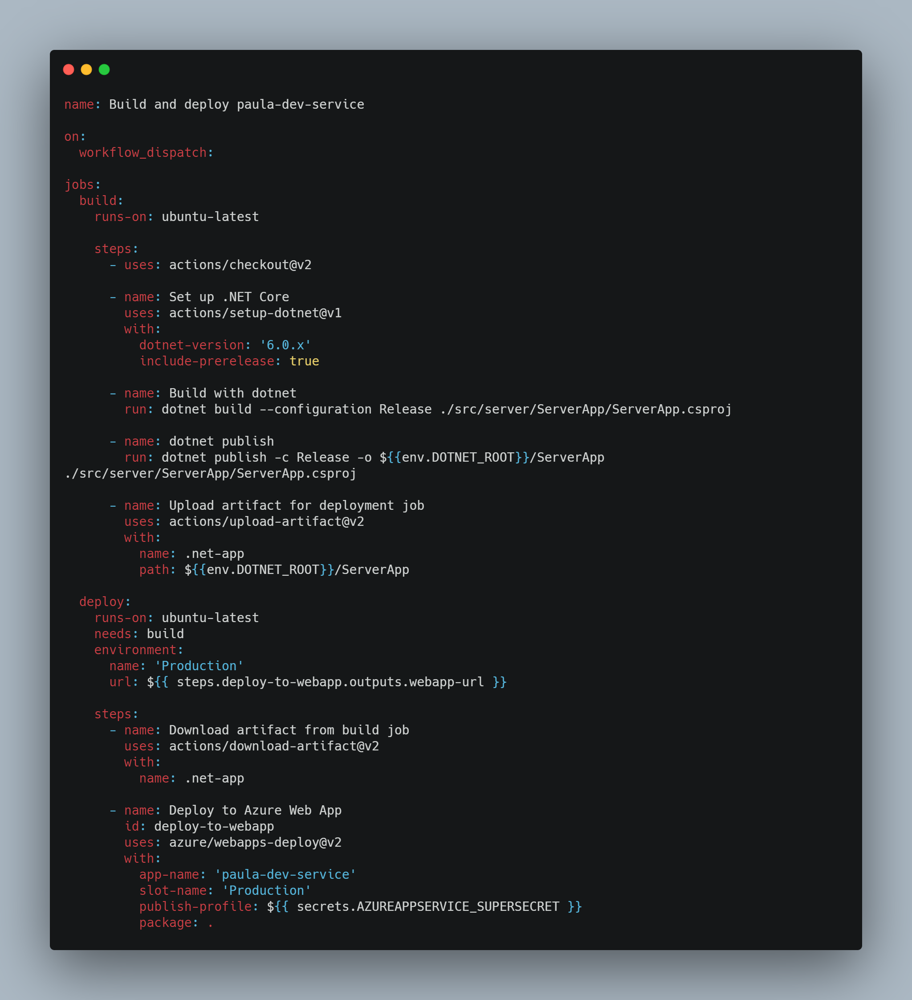
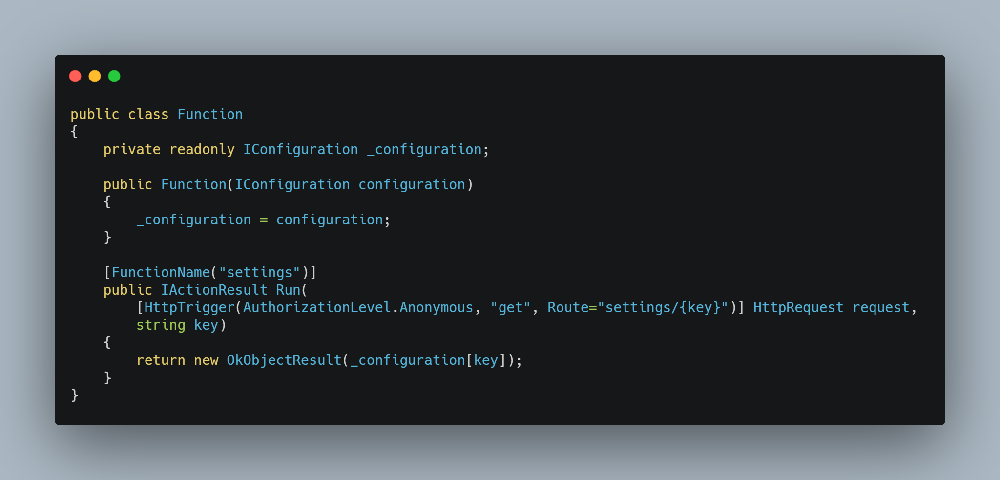
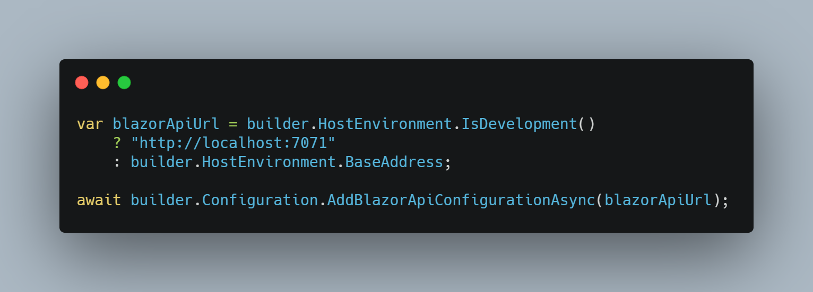

# Building a Business Application, Part 5

Although an experimental application is just an experiment and will probably never run in a public domain it should respect the fact that software development leads to deployment.

My application is basically a one man show. Another term could be one man power development team. This is not very much and that needs to go into consideration when an application is to go live.

I can't manage a server or even some containers orchestration myself. I would like to, but reality needs to be respected if your personal working hours for an experimental application is between eight and next to none hours a week.

That is the reason why I choose to deploy my application with the help of a couple of Azure services. Platform as a Service (PaaS) seem to be the right terminology here. I choose Azure as cloud provider out of prejudice. I used it before and it worked well for me. 

Azure offers dozens of services, but for now I really only need the following.
* Azure Cosmos DB,
* Azure App Service
* Azure Static Web App

The Azure App Service hosts my API project, which communicates with the Azure Cosmos DB. The front end, which is a Blazor WebAssembly application, will be hosted by the Azure Static Web App.

# Azure Comos DB

The creation of the Azure Cosmos DB is not problematic, but you need to keep watch on the costs of your request units. For small workloads this type of database is free, but if your demand rises or your application causes uncontrolled database queries the cost counter could become problematic.
I opted for a serverless model, as it will only cause cost when I access the database. For an experimental deployment which only needs the database once in a while that payment model makes sense.

# Azure App Service

Azure offers supreme support for GitHub Actions that make it easy to deploy projects to Azure. With the help of some templates I was able to deploy my API in a couple of steps. The communication with the Azure Cosmos DB worked out of the box, after I configured the connection strings.

# Azure Static Web App

When I planned the deployment of the Azure Static Web App, I was confronted with a small configuration issue. The front end needs a configuration setting which contains the URL of the API.

It turned out that this is not just a configuration setting in the Azure Static Web App. Configuration settings are supported but they are not available in the Azure Static Web App. They are only available to internal Azure Functions which are available on HTTP endpoints.

I basically have three options to figure out the URL of the API
- Hardcode the URL
- Create the appsettings.json on the fly during deployment
- Use an Azure Function of the Azure Static Web App

Hard coding anything is not really an option and creating the appsettings.json during deployment will take the ability to modify the URL after deployment.

I decided to write a small Azure Function which will return the settings via a simple HTTP GET endpoint.

Additionally, I wrote a small configuration provider and added it to the configuration builder during startup.

One important thing is that the configuration needs to be loaded asynchronously at the start of the Blazor WebAssembly. This is caused by the configuration system being synchronously and the HttpClient being asynchronously. Usually I would just wait on the result of the asynchronously Operation, but that is not possible with the Blazor runtime. 

A bug which I encountered while deploying the Blazor WebAssembly was in my SignalR setup. My pseudo reliable authorization token was not transmitted when the WebSocket connection was established. WebSockets do not transfer the authorization token in an HTTP header as they don’t have one. SignalR knows this and adds the token automatically to the query string. I just modified the detection of the token, which solved the problem.

In theory anybody in the world could now use my application, but as this environment is only for development tests you need to ask me before I share the URL with you.

Check out the repository if you are interested in the Azure Static Web App deployment file or in the source code in general. 
Bye.
