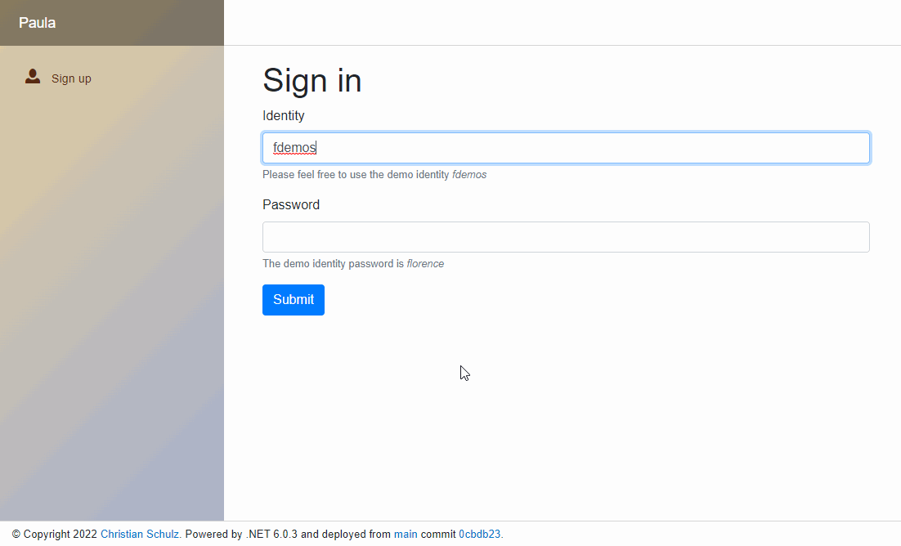

A long time has past since I wrote something about my experimental business application, but this does not mean that I didn’t continue experimenting.

Over the last couple of months I added some features and refactored parts of the code. The whole application still lives and evolves.

But not only has the application evolved, I adjusted my approach for planning and implementing new features.

As I was trying to organize my feature planning I remembered *Trello*, which my company used briefly a couple of years back. I now use it to track upcoming features with some simple notes and checklist. The feature descriptions are not high literature, but they help me to stay focused.

My usage of *GitHub* has changed a little bit. *Pull Request* and release branches are now part of the development cycle. You might say that *Pull Request* for a single person repository might be a bit much, but it works for me.

The luxury of this project is that I can focus in my own pace. If I detect a bug or conceptual error, I step back for a day or two and let it sink in. In previews projects I sometimes wanted to fix conceptually errors immediately, which sometimes made things even worst. Stepping back, doing something else, like going for a walk, seems to be a better approach.

From the beginning of this project I had a minimal use case, which I extended only a bit in the last couple of month. The main focus went into refactoring and forming the application in a presentable preview form.

Last week I finally decided that a presentable preview is basically done. (The term preview form might be a stretch as I lack the proper amount of UI/UX mojo.) A demo account allows users to view all the features and play around.

* https://agreeable-meadow-01b252003.azurestaticapps.net/
  * (I only tested Microsoft Edge)

The target group of this application is me, as the purpose is me learning more about *.NET* and self organization. For this reason I did not elaborate on the application itself in this post.

I will continue experimenting over the next couple of month. Who knows what kind of monster this thing will become.